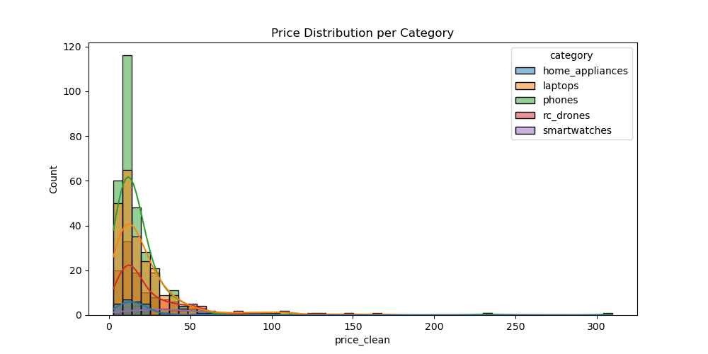
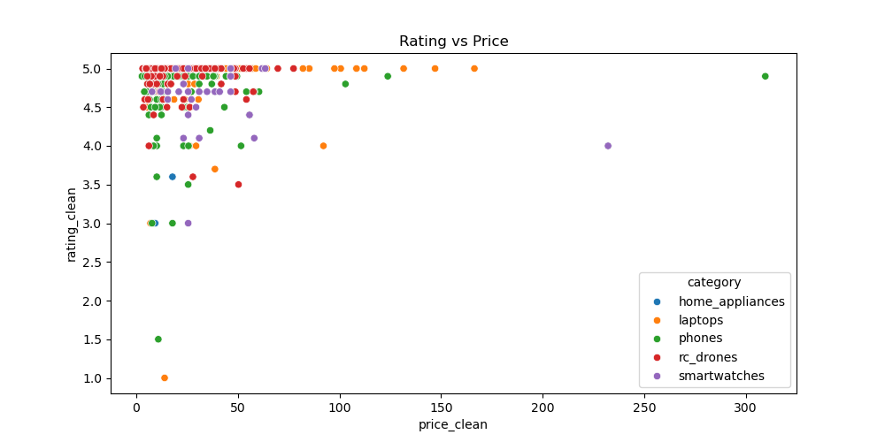
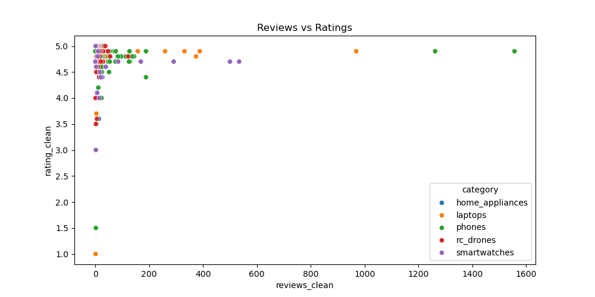
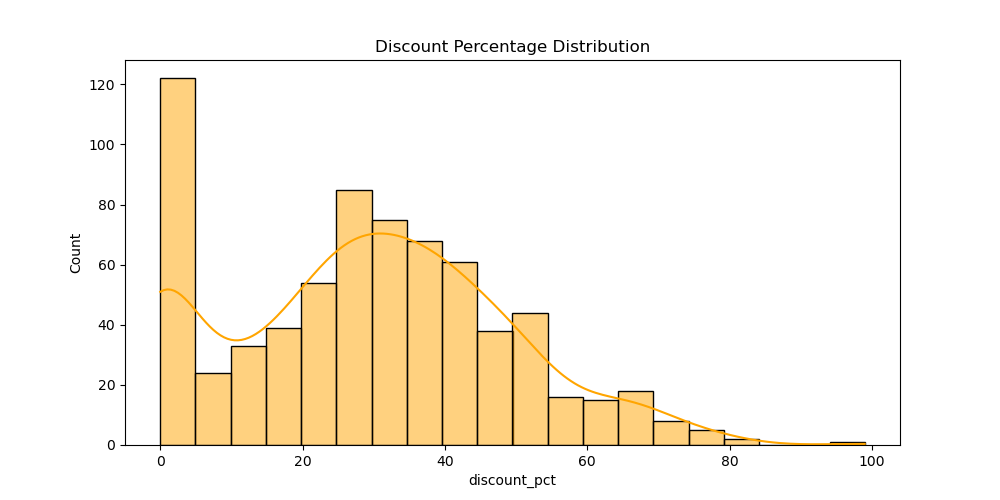
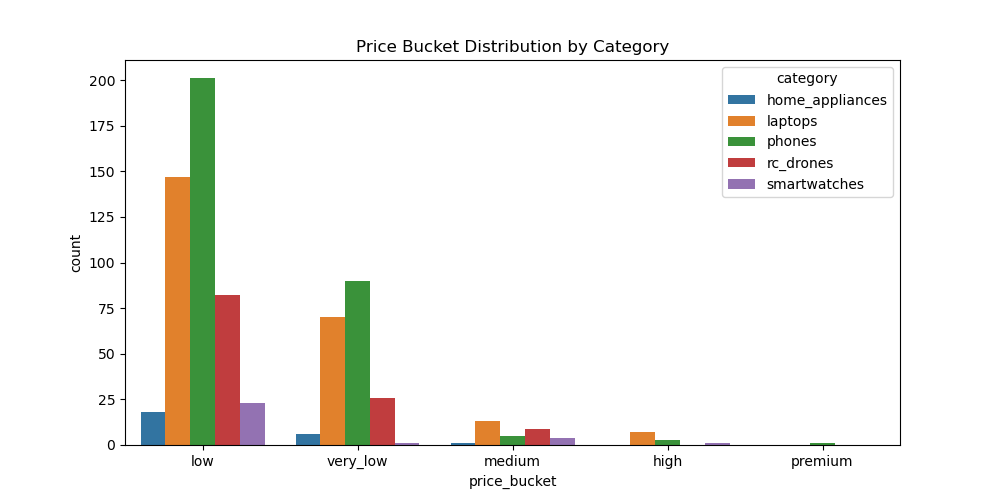

<div align="center">

<h1>🛒 Banggood Product Analysis Pipeline</h1>

<p>
<b>End-to-end product analytics project using web scraping, data cleaning, EDA, SQL Server, and Streamlit.</b>
</p>

<p>


</p>

</div>

---

## 📌 Project Overview

This project analyzes product listings from **Banggood.com** through a complete data pipeline. It collects product data using Selenium, cleans and transforms raw CSV files with Pandas, generates exploratory visualizations, loads the cleaned dataset into SQL Server, and provides an interactive Streamlit dashboard.

The project demonstrates practical skills in **web scraping, data engineering, data analysis, SQL, and dashboard development**.

---

## 🎯 Objectives

- Scrape product data from multiple Banggood categories
- Store raw scraped data in CSV format
- Clean and transform product fields such as price, old price, rating, reviews, and discount
- Create useful derived features such as value score and price buckets
- Generate exploratory data analysis plots
- Load cleaned data into SQL Server
- Run SQL queries for business insights
- Build an interactive dashboard with Streamlit

---

## 🧰 Pipeline Workflow

```text
Banggood Website
      │
      ▼
Selenium Web Scraper
      │
      ▼
Raw CSV Files
      │
      ▼
Pandas Cleaning & Transformation
      │
      ▼
Cleaned Combined Dataset
      │
      ├──► EDA Plots
      │
      ├──► SQL Server Table
      │
      └──► Streamlit Dashboard
```

---

## 📂 Project Structure

```text
Banggood-Product-Analysis-Pipeline/
│
├── data/
│   ├── raw/
│   │   ├── home_appliances_raw.csv
│   │   ├── laptops_raw.csv
│   │   ├── phones_raw.csv
│   │   ├── rc_drones_raw.csv
│   │   └── smartwatches_raw.csv
│   │
│   └── cleaned/
│       └── combined_cleaned.csv
│
├── plot_images/
│   ├── discount_distribution.png
│   ├── price_buckets.png
│   ├── price_distribution.png
│   ├── rating_vs_price.png
│   └── reviews_vs_ratings.png
│
├── src/
│   ├── main.py
│   ├── scrapper/
│   │   └── banggood_scraper.py
│   ├── cleaning_transformation/
│   │   └── clean_banggood_data.py
│   ├── analysis/
│   │   └── banggood_analysis.py
│   ├── database_sql/
│   │   └── banggood_to_sql.py
│   └── streamlit/
│       └── app.py
│
├── util/
│   ├── __init__.py
│   ├── file_paths.py
│   ├── helpers.py
│   └── logger.py
│
├── sql_queries.sql
├── requirements.txt
├── environment.yml
├── README.md
├── LICENSE
└── .gitignore
```

---

## 🔎 Data Collected

The scraper collects product data from five categories:

- Phones
- Smartwatches
- Laptops
- RC Drones
- Home Appliances

Main fields include product name, price, old price, discount, rating, reviews, product URL, and category.

---

## 🧹 Data Cleaning & Transformation

The cleaning script converts raw scraped fields into clean numeric columns.

Important cleaned columns:

```text
price_clean
old_price_clean
rating_clean
reviews_clean
discount_clean
discount_pct
value_score
price_bucket
```

The final cleaned dataset is saved as:

```text
data/cleaned/combined_cleaned.csv
```

---

## 📊 Exploratory Data Analysis

The analysis script generates five visualizations inside the `plot_images/` folder.

### Price Distribution



### Rating vs Price



### Reviews vs Ratings



### Discount Distribution



### Price Buckets



---

## 🗄️ SQL Server Loading

The cleaned dataset can be loaded into SQL Server using:

```text
src/database_sql/banggood_to_sql.py
```

The SQL table used in this project is:

```text
BanggoodProducts
```

SQL analysis queries are available in:

```text
sql_queries.sql
```

> Note: SQL Server, `BanggoodDB`, ODBC Driver 17, and the correct local server name must exist before running the database loading script.

---

## 📈 SQL Analysis Included

The SQL file includes queries for average price, average rating, product count, top reviewed products, highest discount products, best value products, price bucket distribution, and category-level summaries.

---

## 📊 Streamlit Dashboard

Run the Streamlit dashboard using:

```bash
streamlit run src/streamlit/app.py
```

---

## 🚀 How to Run This Project

Clone the repository:

```bash
git clone https://github.com/CodeByMan/Banggood-Product-Analysis-Pipeline.git
```

Open the project folder:

```bash
cd Banggood-Product-Analysis-Pipeline
```

Create environment using Conda:

```bash
conda env create -f environment.yml
conda activate banggood_env
```

Or install using pip:

```bash
pip install -r requirements.txt
```

Run the full pipeline:

```bash
python src/main.py
```

Run the dashboard:

```bash
streamlit run src/streamlit/app.py
```

---

## 🛠️ Tools and Technologies

| Tool / Library | Purpose |
|---|---|
| Python | Main programming language |
| Selenium | Web scraping |
| WebDriver Manager | Browser driver management |
| Pandas | Data cleaning and transformation |
| NumPy | Numerical operations |
| Matplotlib | Data visualization |
| Seaborn | Statistical plots |
| SQLAlchemy | SQL Server connection |
| PyODBC | SQL Server driver support |
| SQL Server | Database storage and SQL analysis |
| Streamlit | Dashboard application |

---

## 👤 Author

**Muhammad Ali Nawaz**  
Data Analyst

---

## 📄 License

This project is licensed under the [MIT License](LICENSE).

---

<p align="center">
<b>⭐ If you found this project useful, consider giving it a star!</b>
</p>
